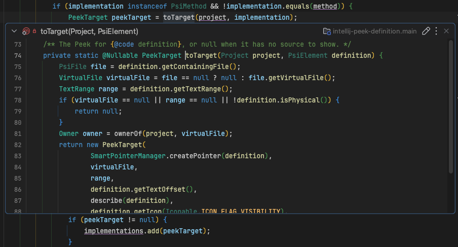

<div align="center">
    <a href="https://plugins.jetbrains.com/plugin/34437-peek-definition">
        
    </a>
</div>

<h1 align="center">Intellij Code Marker</h1>

<p align="center">
<a href="https://plugins.jetbrains.com/plugin/34437-peek-definition"></a>
<a href="https://plugins.jetbrains.com/plugin/34437-peek-definition"></a>
<a href="https://plugins.jetbrains.com/plugin/34437-peek-definition"></a>
</p>

<br>

> Jetbrains Marketplace: https://plugins.jetbrains.com/plugin/34437-peek-definition

**Peek Definition** for IntelliJ IDEA: shows the definition of the symbol at the caret
right below the current line, inside the editor you are working in, so you can read an
implementation without leaving your file or losing your place.

Unlike Quick Definition, the Peek is not a popup: it does not cover your code,
it stays open while you keep working, and you can open several at once.



## Features

- **Embedded in the editor**: the definition opens between the lines of your code, with the
  lines below moved down instead of hidden.
- **Just the definition**: the Peek shows only the method, with its signature and module in the
  header, like Quick Definition. Switch to the whole file or turn on line numbers from the **⋮** menu;
  your choice is remembered for the next Peek. It is a real editor on the real file: it uses your
  color scheme, font and theme, *Ctrl+Click* works inside it, and it updates live when the file changes.
- **Accurate**: definitions are resolved the same way as *Go to Declaration*, so overloads,
  constructors and library classes (attached or decompiled sources) resolve correctly.
- **Several Peeks at once**: peek from different lines and every Peek stays open. Peeking from
  inside a Peek replaces its content with the new definition.
- **Read-only**: opening, switching and closing a Peek never modifies your code.

## Usage

1. Put the caret on a method call or constructor in a Java file.
2. Right-click → **Peek Definition**, or **Navigate → Peek Definition**.
3. Optional: bind a key in **Settings → Keymap → Peek Definition** (no shortcut is assigned by default).

In the Peek:

| Action | Result |
| --- | --- |
| Click the title bar | Collapse / expand |
| Double-click the title bar | Open the file in a regular editor tab |
| **▼** / **▶** button | Collapse / expand |
| **⋮** menu | Open in Editor, Collapse / Expand, Method Only / Whole File, Show Line Numbers, Close |
| **Esc** inside a Peek, or its **×** button | Close that Peek |
| **Esc** in the editor | Close all Peeks of the editor |
| Peek Definition inside a Peek | Replace its content with the new definition |

## Compatibility

IntelliJ IDEA 2024.2 or later, Community and Ultimate.

## Build

Requires JDK 17+ to run Gradle; the plugin compiles for Java 21 against IntelliJ IDEA 2024.2.

```bash
./gradlew test          # run the tests
./gradlew runIde        # sandbox IDE with the plugin installed
./gradlew buildPlugin   # build/distributions/intellij-peek-definition-<version>.zip
```
